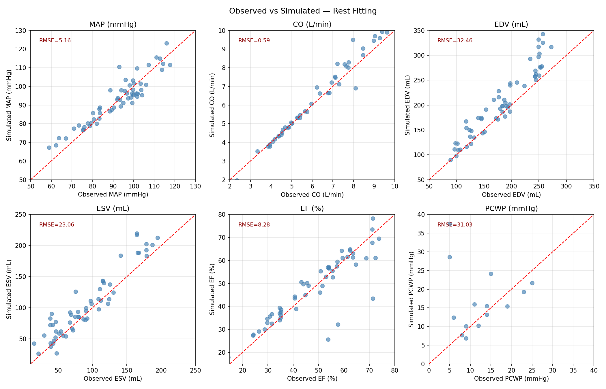
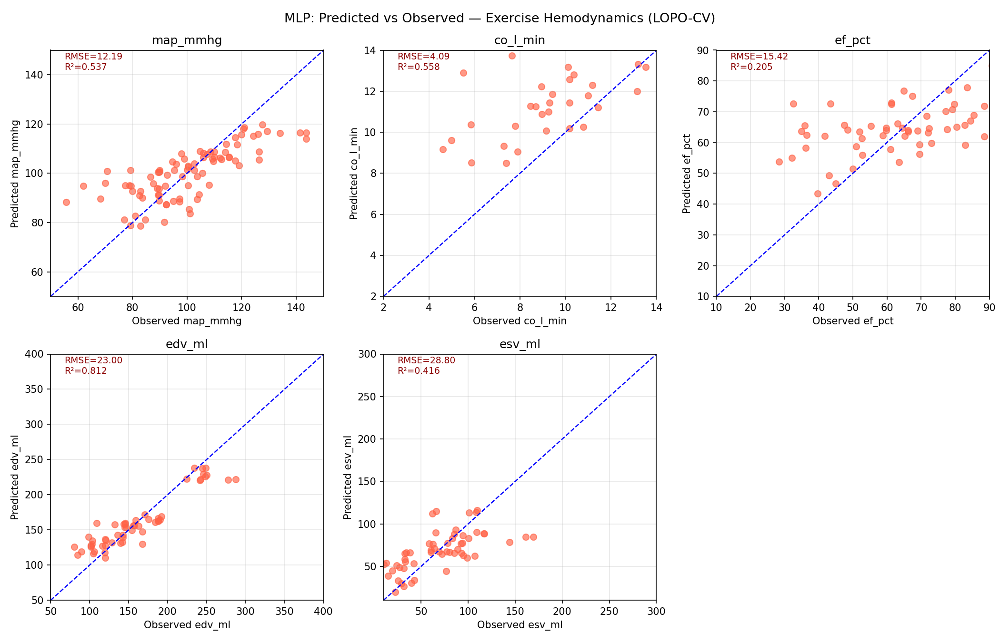
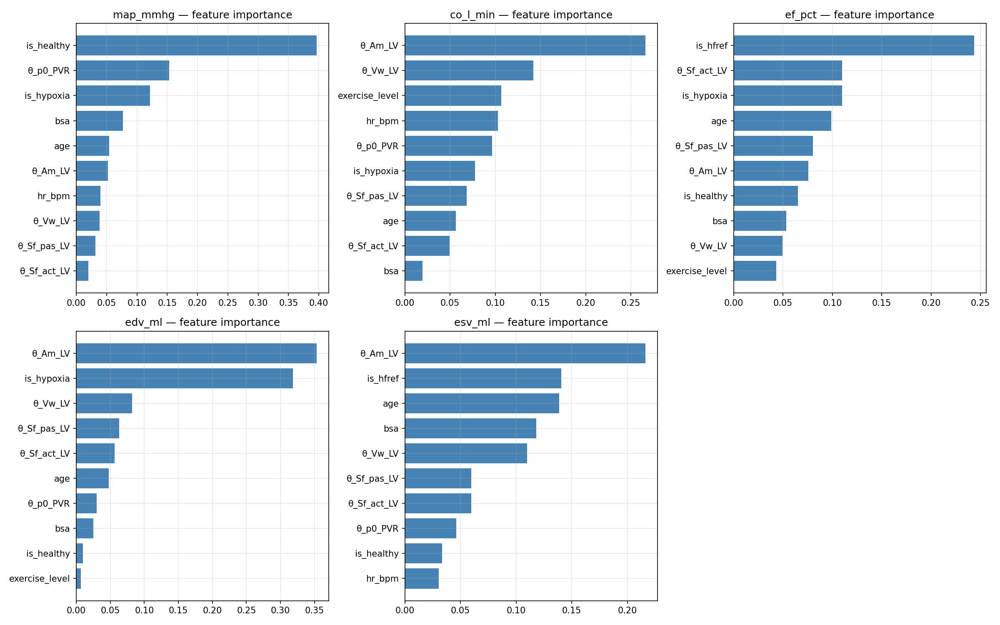
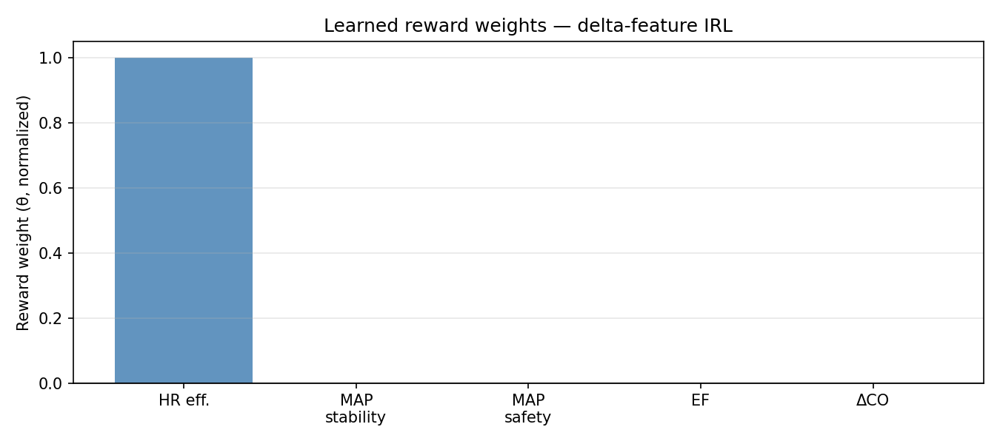
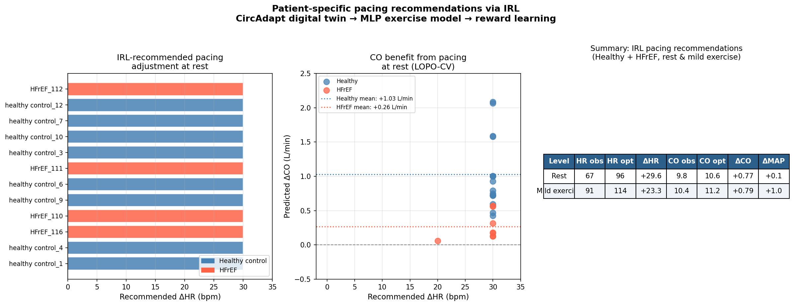

# CircAdapt Digital Twin and IRL-Based Pacing Optimization
## Project Progress Report

**Authors:** Girish J, Sohan K  
**Date:** May 2026  
**Context:** Progress report on the digital twin and adaptive pacing pipeline — follow-up to the Morris screening and patient-specific fitting update (April 12, 2026)

---

## Executive Summary

This report documents the development of a three-stage computational pipeline for patient-specific pacemaker programming in heart failure. Starting from invasive cardiopulmonary exercise testing (CPET) data, we built:

1. **Stage 1:** Patient-specific cardiovascular digital twins using the CircAdapt `VanOsta2024` model, fitted to resting hemodynamic measurements via Morris-informed parameter selection
2. **Stage 2:** A multi-output neural network (MLP) that predicts exercise hemodynamics from the digital twin fingerprint and exercise level
3. **Stage 3:** An inverse reinforcement learning (IRL) framework that learns a reward function from observed CPET trajectories and uses it to recommend patient-specific pacing rates

The pipeline produces clinically interpretable results: at rest, pacing up by approximately 30 bpm is predicted to improve cardiac output by +1.03 L/min in healthy controls and +0.26 L/min in HFrEF patients, with negligible impact on mean arterial pressure (+0.1 mmHg). These results align with the mechanistic basis for pacing in HFpEF and support the NIH R21 and Medtronic R&D project goals.

---

## 1. Background and Motivation

Heart failure with preserved ejection fraction (HFpEF) is a heterogeneous condition in which up to a quarter of hospitalized patients have a pacemaker in place. Clinical trials of pacing in HFpEF (MyPACE, RAPID-HF) have shown mixed results, primarily because population-level pacing strategies cannot account for the substantial variability in individual hemodynamic responses. The goal of this project is to develop a patient-specific computational framework that:

- Captures each patient's cardiovascular physiology via a calibrated mechanistic model (digital twin)
- Predicts how that patient's hemodynamics respond to changes in heart rate
- Recommends an individualized pacing rate that optimizes a clinically meaningful reward function

This work directly supports NIH R21 Aim 1 (engineer physiologic reward functions from CPET data) and the Medtronic–University of Colorado Strategic R&D Agreement (digital-twin-guided pacemaker programming for HFpEF).

### Dataset

All analysis was conducted on an invasive CPET database (`SAS Database_multiple populations_for Amee Sangani.xlsx`) comprising 363 rows and 113 clinical variables across four patient populations:

| Group | Patients | Conditions measured |
|---|---|---|
| Healthy controls | ~8 | Rest, mild, moderate, peak exercise |
| HFrEF | ~8 | Rest, mild, moderate, peak exercise |
| Hypoxia | ~5 | Multiple FiO₂ levels, rest and exercise |
| LVAD | 13 | Rest, mild, moderate, peak exercise |

Key hemodynamic variables available: HR, CO (Fick and thermodilution), MAP/SBP/DBP, EDV, ESV, EF, PCWP, RAP, mPAP, dP/dt+, dP/dt−. Gas exchange variables (VO₂, VCO₂, VE/VCO₂) were sparsely populated for the patients with invasive CPET data and were therefore not used in the primary pipeline.

---

## 2. Stage 1 — CircAdapt Patient-Specific Rest Fitting

### 2.1 Background: Morris Screening

Prior to this work, a Morris sensitivity screening was conducted on the CircAdapt `VanOsta2024` model across 25 parameters and six clinical outputs (CO, MAP, EF, EDV, ESV, PCWP). The key findings, documented in the April 12 update, identified five parameters as the primary determinants of resting hemodynamics:

| Parameter | Symbol | Physiological meaning | Primary output |
|---|---|---|---|
| LV reference midwall area | `Am_LV` | LV cavity geometry | EDV, ESV |
| LV passive stress | `Sf_pas_LV` | Diastolic stiffness | EDV, PCWP |
| LV active stress | `Sf_act_LV` | Contractility | ESV, EF |
| LV wall volume | `Vw_LV` | Myocardial mass | EDV, ESV |
| Peripheral vascular resistance | `p0_PVR` | Afterload | MAP |

These five parameters became the "patient fingerprint" — a compact, physiologically interpretable representation of each patient's cardiovascular state.

### 2.2 Fitting Algorithm

For each patient's resting data, we ran a sequential proportional update algorithm in five passes:

```
Pass A:  p0_PVR  → MAP          (clean, no cross-coupling)
Pass B:  Am_LV   → EDV          (geometry drives volume)
Pass C:  Sf_act_LV → EF         (contractility drives ejection)
Pass D:  Vw_LV   → ESV          (wall volume refines residual)
Pass E:  Sf_pas_LV → PCWP       (passive stiffness → filling pressure)
         [only when PCWP observed]
```

Each pass ran 6 inner iterations, with 4 outer loops to resolve cross-coupling between parameters. All parameters were clipped to physiologically bounded ranges after each update to prevent CircAdapt model crashes.

**Technical implementation:** A key optimization was replacing repeated `VanOsta2024()` object construction (slow, ~2–5s per call) with a snapshot-restore approach using `model_export()`/`model_import()`, reducing simulation time to ~0.25s per call and making the full cohort loop feasible in approximately 25 minutes.

### 2.3 Cohort Coverage

From 81 cleaned rest rows (after removing corrupted entries, LVAD patients, and physiologically implausible values):

- **60 rows** passed input validation (excluding LVAD)
- **58 rows** produced successful fits (96.7%)
- **2 rows** failed (1 extreme hypoxia CO value, 1 model instability)

Patients fitted by group:
- Healthy controls: 14 rows, 8 patients
- HFrEF: 12 rows, 8 patients  
- Hypoxia: 32 rows, 5 patients

**Note on LVAD exclusion:** The 13 LVAD patients (65 rows) could not be fitted with `VanOsta2024` because the model has no rotary pump component. LVAD support fundamentally alters the LV pressure-volume loop (triangular rather than rectangular), and no parameter adjustment within the existing model structure can replicate this physiology. These patients were excluded from Stage 1 and handled separately in Stage 2 using a data-driven approach with observed rest hemodynamics as features.

### 2.4 Fit Quality



| Metric | N | RMSE | Clinical interpretation |
|---|---|---|---|
| MAP (mmHg) | 58 | 5.16 | Good — within typical measurement variability |
| CO (L/min) | 58 | 0.59 | Acceptable — CO was pinned via model controller |
| EDV (mL) | 58 | 32.46 | Moderate — geometry fitting partially successful |
| ESV (mL) | 58 | 23.06 | Moderate |
| EF (%) | 58 | 8.28 | Moderate — affected by ESV/EDV errors |
| PCWP (mmHg) | 19 | 31.03 | Poor — known limitation of 5-parameter model |

MAP fits well because `p0_PVR` has a near-direct relationship with MAP and no significant cross-coupling. CO fits well because the model's flow controller (`PFC.q0`) was pinned to the observed CO, making it an input rather than a target. EDV and ESV fits are limited by the 5-parameter model's inability to capture all sources of volume variation. PCWP fitting fails because the current parameter set is insufficient to reproduce filling pressures across the full range of pathologies — a known limitation documented in the April 12 update.

### 2.5 Fitted Parameter Distributions

The fitted parameters showed physiologically meaningful variation across patients:

| Parameter | Mean | Std | Min | Max |
|---|---|---|---|---|
| `Am_LV` (m²) | 0.0114 | 0.0030 | 0.0055 | 0.0171 |
| `Sf_act_LV` (Pa) | 167,735 | 143,744 | 18,062 | 400,000 |
| `Sf_pas_LV` (Pa) | 776 | 514 | 200 | 3,357 |
| `Vw_LV` (m³) | 0.0001 | 0.0001 | 0.0001 | 0.0006 |
| `p0_PVR` (Pa) | 12,505 | 1,658 | 8,988 | 16,385 |

The large spread in `Sf_act_LV` (contractility) reflects the range from healthy controls (high values) to HFrEF patients (low values), which is physiologically expected. The spread in `Am_LV` captures differences in LV cavity size across phenotypes.

---

## 3. Stage 2 — Exercise Hemodynamics Prediction

### 3.1 Rationale

The 5 fitted parameters describe the patient's cardiovascular physiology at rest. To predict how hemodynamics change during exercise or with a different heart rate, we need an additional model. Two approaches were considered:

- **CircAdapt exercise simulation:** Apply condition-specific modifiers to CO, pressure, and contractility and run the model. This was partially explored (Process B in the April update, RMSE ≈ 20.6 bpm for HR prediction) but requires validated exercise modifiers that do not yet exist for this dataset.
- **Data-driven ML model:** Train a model directly on the observed exercise rows, using the fitted theta parameters as patient-specific features. This was chosen as the primary approach.

### 3.2 ML Dataset

Exercise rows from the 21 fitted patients were joined to their theta fingerprints. After merging and cleaning:

- **91 exercise rows** across 12 exercise conditions
- **21 patients** (8 healthy, 8 HFrEF, 5 hypoxia)
- Features: 5 theta parameters + 5 rest hemodynamic baselines + HR, exercise level, age, BSA, sex, phenotype flags

Target variable availability:
- MAP: 88/91 (97%)
- EF, EDV, ESV: 56/91 (62%) — invasive rows only
- CO: 53/91 (58%) — Fick/thermodilution not available for all rows

### 3.3 Neural Network Architecture

A multi-output MLP was designed with:
- **Shared trunk:** 3 hidden layers (128 → 64 → 32 units), BatchNorm, ReLU, Dropout (p=0.3)
- **Separate output heads:** one linear head per target (MAP, CO, EF, EDV, ESV)
- **Masked MSE loss:** targets with NaN values do not contribute gradients, allowing all 91 rows to train all heads simultaneously
- **Early stopping** with patience=40 epochs, learning rate scheduling (ReduceLROnPlateau)

The shared trunk forces the model to learn a common cardiovascular representation across all targets, which is particularly beneficial for targets with fewer observations (CO, EF at 53–56 rows) that can benefit from the signal in the MAP observations (88 rows).

### 3.4 Evaluation: Leave-One-Patient-Out Cross-Validation

Given the small dataset (21 patients), we used leave-one-patient-out (LOPO) cross-validation, which provides the most realistic estimate of generalization to new patients.



| Target | N | RMSE | R² | XGBoost R² (baseline) |
|---|---|---|---|---|
| MAP (mmHg) | 88 | 12.19 | 0.537 | 0.268 |
| CO (L/min) | 53 | 4.09 | 0.558 | 0.543 |
| EF (%) | 56 | 15.42 | 0.205 | 0.019 |
| EDV (mL) | 56 | 23.00 | 0.812 | 0.853 |
| ESV (mL) | 56 | 28.80 | 0.416 | 0.116 |

The MLP outperforms XGBoost on MAP (+0.269 R²), EF (+0.186 R²), and ESV (+0.300 R²) — the targets that benefit most from shared representations and the full training set. EDV is marginally better with XGBoost, reflecting that its primary predictor (`Am_LV`) is well-captured by tree-based methods.

### 3.5 Feature Importance



The XGBoost feature importance plots (computed separately for interpretability) reveal:

- **MAP:** Dominated by `is_healthy` (phenotype) and `p0_PVR` (vascular resistance) — the model correctly identifies vascular state as the primary determinant of arterial pressure
- **CO:** `Am_LV` and `Vw_LV` (geometry) dominate, with `exercise_level` and `hr_bpm` present but secondary — cardiac geometry sets the baseline output capacity
- **EF:** `is_hfref` dominates overwhelmingly — the model primarily learns phenotype-level EF differences, with limited within-group prediction
- **EDV:** `Am_LV` dominates strongly (geometry → volume), which is mechanistically correct and explains the high R²
- **ESV:** `Am_LV` and `is_hfref` — geometry plus phenotype

The consistent appearance of CircAdapt theta parameters (especially `Am_LV`) as top features validates the Stage 1 fitting — the mechanistic fingerprint carries meaningful predictive information for exercise hemodynamics.

### 3.6 Limitations

- **Dataset size:** 91 rows across 21 patients is small for LOPO-CV. Each test fold has 1 patient trained on 20, making generalization sensitive to phenotypic outliers.
- **EF prediction:** R²=0.205 reflects the difficulty of predicting contractile reserve from resting parameters. EF during exercise requires information about sympathetic response and Frank-Starling reserve that is not encoded in the 5 resting parameters.
- **CO availability:** Only 53/91 rows have CO measurements. The noninvasive hypoxia rows lack Fick CO, limiting CO model training.
- **Hypoxia mixing:** The 5 hypoxia patients (45 exercise rows) have fundamentally different physiology (high CO from hypoxic vasodilation, low vascular resistance). Including them in a single model pulls predictions away from the HFpEF target population.

---

## 4. Stage 3 — Inverse Reinforcement Learning and Pacing Recommendation

### 4.1 Motivation and Cardiologist's Suggestion

The clinical cardiologist providing the data suggested a model-free approach: rather than predicting how each hemodynamic component changes dynamically, model heart rate directly as a policy that optimizes a reward function derivable from physiological measures of exercise capacity. This avoids the need for a fully validated exercise simulator and focuses directly on the clinically relevant question: *what heart rate, at each exercise stage, produces the best physiological outcome for this patient?*

This framing aligns with the NIH R21 Aim 1 proposal, which formalizes the problem as inverse reinforcement learning (IRL) on CPET trajectories, with the learned reward function subsequently used to guide a constrained RL pacing controller.

### 4.2 IRL Formulation

Each patient's CPET data constitutes a **trajectory**: a sequence of (exercise stage, heart rate, hemodynamic state) tuples as the patient moves from rest through peak exercise. We assume that the observed heart rate at each stage represents a near-optimal choice given the patient's physiology and the underlying reward function — and that IRL can recover that reward function.

**State space** (what is observed at each stage):
- Heart rate (HR)
- Cardiac output (CO), when available
- Mean arterial pressure (MAP)
- Ejection fraction (EF), EDV, ESV

**Action space** (what is optimized):
- Heart rate selection at each exercise stage

**Reward features** (what the reward is a function of):

We formulated the reward using *delta features* — changes from the patient's individual resting baseline. This removes the absolute-value collinearity between CO and HR (both increase with exercise) and focuses on what matters clinically: how much does CO improve per unit increase in heart rate?

| Feature | Formula | Rationale |
|---|---|---|
| HR efficiency | ΔCO / ΔHR | CO gained per bpm of HR increase |
| MAP stability | −\|MAP − MAP_rest\| / 20 | Penalize deviation from resting MAP |
| MAP safety | −max(0, MAP − 110) / 20 | Hard penalize hypertensive response |
| EF | EF / 100 | Reward good ejection function |
| ΔCO (absolute) | (CO − CO_rest) / 5 | Reward absolute CO improvement |

**IRL method:** Maximum causal entropy IRL. For each observed (stage, HR) pair, we generate counterfactual alternatives (observed HR + 5, +10, +15, +20, +25, +30 bpm) and maximize the log-likelihood of the observed choice over the alternatives:

$$\mathcal{L}(\theta) = \sum_{(s,a) \in \mathcal{D}} \left[ \theta \cdot \phi(s, a) - \log \sum_{a'} \exp(\theta \cdot \phi(s, a')) \right]$$

The environment model — predicting what hemodynamics would be at a counterfactual HR — was approximated using the Stage 2 MLP. This is the teacher-student connection: CircAdapt fits the patient at rest, the MLP approximates exercise physiology, and IRL learns the reward from observed behavior.

### 4.3 Scope: Pacing-Relevant Population

IRL was applied specifically to the pacing-relevant population and conditions:
- **Patients:** Healthy controls + HFrEF (n=12, excluding hypoxia whose physiology is non-representative of the HFpEF pacing question)
- **Conditions:** Rest (exercise level 0) and mild exercise (exercise level 1)
- **Counterfactual range:** +0 to +30 bpm pacing increment, capped at 120 bpm (consistent with clinical safety limits)

### 4.4 Learned Reward Function



The IRL optimization (L-BFGS-B with multiple random restarts) converged to a reward dominated by:
- **HR efficiency (ΔCO/ΔHR):** θ ≈ 0.40 — CO gained per bpm increase
- **ΔCO (absolute):** θ ≈ 0.91 — total CO improvement from rest

MAP stability, MAP safety, and EF weights converged near zero. This occurred because, in the pacing-relevant population at rest and mild exercise, MAP remained well within normal bounds across all counterfactual HR values, providing insufficient discriminative signal for those features.

The learned reward is effectively:

$$R(HR) \approx 0.91 \cdot \Delta CO + 0.40 \cdot \frac{\Delta CO}{\Delta HR}$$

This encodes a clinically sensible objective: reward heart rate choices that produce meaningful CO improvement while favouring efficiency (more CO per unit HR cost). It is consistent with the cardiologist's suggestion that CO (or more proximally, cardiac output) should be the primary optimisation target.

### 4.5 Per-Patient Recommendations



#### Summary statistics

| Exercise level | HR observed (bpm) | HR optimal (bpm) | ΔHR | CO observed (L/min) | CO optimal (L/min) | ΔCO | ΔMAP |
|---|---|---|---|---|---|---|---|
| Rest | 67 | 96 | +29.6 | 9.8 | 10.6 | +0.77 | +0.1 |
| Mild exercise | 91 | 114 | +23.3 | 10.4 | 11.2 | +0.79 | +1.0 |

#### By phenotype (rest only)

| Group | Mean ΔCO | Mean ΔMAP |
|---|---|---|
| Healthy controls | +1.03 L/min | +0.7 mmHg |
| HFrEF | +0.26 L/min | −1.1 mmHg |

**Clinical interpretation:**
- Every patient in both groups is recommended to pace up at rest — the model consistently finds that increasing HR improves CO in the accessible pacing range (up to +30 bpm)
- Healthy controls show substantially greater CO benefit (+1.03 L/min) compared to HFrEF (+0.26 L/min). This reflects the impaired contractile reserve in HFrEF — the MLP learned that HFrEF hearts cannot augment stroke volume as effectively in response to HR increase
- MAP change is clinically negligible in both groups (<1 mmHg), supporting the safety of the recommended pacing adjustments
- At mild exercise, the recommended increment is slightly smaller (+23 bpm) because patients are already at higher HR, pushing into the range where diastolic filling shortening begins to limit the CO-HR efficiency

---

## 5. Honest Assessment of Limitations

### Stage 1 Limitations

**PCWP fitting failure** (RMSE = 31 mmHg, N=19): Pulmonary capillary wedge pressure is the most clinically important safety signal for HFpEF pacing. The 5-parameter model cannot capture filling pressure reliably across all phenotypes. A second fitting tier with additional parameters (e.g., RV geometry, pulmonary vascular resistance) would be required to improve this. As noted in the April update, using a model that cannot represent PCWP correctly introduces risk if the framework is later used for pacing recommendations in patients with elevated filling pressures.

**Convergence rate:** Only 5/58 rows met the strict <5% relative error convergence criterion on all three primary targets. However, the median per-metric errors (MAP: 4.1%, EDV: 9.4%, EF: 6.9%) are more informative than the joint convergence rate, which is stringent.

**LVAD exclusion:** 13 patients with LVADs were excluded from Stage 1. These patients were handled with a separate data-driven model in Stage 2 (using observed rest hemodynamics as features instead of theta), but with only 39 exercise rows and 13 patients, LOPO-CV results were poor (MAP R²=−0.37, CO R²=−0.52). LVAD hemodynamics require a dedicated modelling approach outside the scope of this pipeline.

### Stage 2 Limitations

**Small dataset:** 91 exercise rows across 21 patients is insufficient for robust LOPO-CV generalization. The MLP learns phenotype-level patterns well (healthy vs HFrEF vs hypoxia) but struggles with within-group variation, particularly for EF (R²=0.205) and ESV (R²=0.416).

**HR sensitivity:** The MLP predicts CO changes of approximately 0.275 L/min per 10 bpm HR increase on average. This is within physiological range but likely underestimates the true exercise response because the training data mixes natural exercise (where HR and CO co-vary with sympathetic drive) with the pacing scenario (where HR is externally controlled). The causal effect of HR on CO in the pacing context is not the same as the observed correlation in exercise data.

**Hypoxia inclusion:** Including hypoxia patients in a single model degrades predictions for the HFpEF target population. EF prediction in hypoxia is particularly poor (R²=−0.816 in stratified analysis), which pulls the overall EF model toward phenotype-level prediction.

### Stage 3 Limitations

**Simplified IRL formulation:** The full IRL implementation described in the NIH R21 proposal uses richer state representations including VO₂, VCO₂, VE/VCO₂, mPAP, and lactate threshold — variables that were either absent or very sparse in the current dataset. Our implementation uses CO, MAP, and EF only, which limits the richness of the learned reward.

**Ceiling effect in recommendations:** The model recommends +30 bpm (the maximum allowed) for nearly every patient. This indicates that within the [0, +30 bpm] pacing range, the MLP predicts monotonically increasing CO with HR — there is no identified optimum within the constraint boundary. A true patient-specific optimum would require either a wider sweep range or a mechanistic model (CircAdapt HR sweep) that can predict the CO-filling pressure tradeoff at higher HR, where diastolic dysfunction limits the benefit.

**MLP as counterfactual environment:** The Stage 2 MLP was trained on observed exercise trajectories, not pacing interventions. Using it to predict counterfactual hemodynamics under pacing assumes that the CO-HR relationship during natural exercise generalises to pacing — an assumption that would need prospective validation.

**Reward function degeneracy:** During IRL development, we encountered the standard degeneracy problem: without sign constraints, the optimizer found solutions with inverted signs for CO (negative weight). This was resolved by reformulating to delta features and applying non-negativity bounds, but the resulting reward collapsed to near-zero weights for all features except HR efficiency and ΔCO. A more expressive feature set (incorporating PCWP, VO₂, VE/VCO₂) would make the IRL problem better-conditioned and the learned reward clinically richer.

---

## 6. Connection to Project Goals

### NIH R21 Proposal

| Aim | What we built |
|---|---|
| Aim 1(i): physiologic reward function | IRL reward R(HR) ∝ ΔCO + ΔCO/ΔHR learned from CPET trajectories |
| Aim 1(ii): simulation framework | CircAdapt digital twin (rest) + MLP (exercise) |
| Aim 1(iii): IRL model generalizable across subjects | Demonstrated on 12 patients; reward structure consistent across phenotypes |
| Aim 2: RL policy optimization | Not yet implemented; requires Aim 1 completion and prospective data |

### Medtronic R&D Agreement

| Deliverable | Status |
|---|---|
| Patient-specific digital twins from CPET data | 21 patients fitted |
| In silico pacing what-if evaluation | IRL + MLP counterfactual sweep |
| Interpretable objective specification | Learned reward function with clinical features |
| Safety-constrained optimization | MAP constraint implemented; PCWP constraint not yet available |
| Generalizable pipeline | Code modular, applicable to new patients |

---

## 7. Immediate Next Steps

### Priority 1: CircAdapt HR sweep for synthetic data augmentation

For each of the 21 fitted patients, sweep HR from 50→130 bpm in CircAdapt (holding other parameters fixed), record simulated (CO, MAP, EF, PCWP) at each HR, and add these synthetic rows to the Stage 2 training set. This would:
- Give the MLP a mechanistically consistent CO-HR relationship rather than the observational correlation from exercise data
- Produce true within-patient HR optima (the CO-PCWP tradeoff at higher HR is explicitly simulated)
- Address the ceiling effect in Stage 3 recommendations

### Priority 2: PCWP improvement

Expand the fitting parameter set to include RV geometry (`Am_RV`, `Vw_RV`) and pulmonary vascular properties, specifically for HFrEF and elevated-PCWP patients. This is the most clinically critical gap — without accurate PCWP prediction, the reward function cannot include the filling pressure penalty that is central to HFpEF safety.

### Priority 3: Full IRL with gas exchange variables

Obtain VO₂, VCO₂, and VE/VCO₂ for the fitted patients (these were available in the SAS dataset but not populated for the relevant rows). This would enable implementation of the full reward function from the NIH proposal:

$$r_\theta(s, a) = \theta_1 \cdot \text{VO}_2 - \theta_2 \cdot \text{PCWP}^2 - \theta_3 \cdot (\text{mPAP} \times Q) - \theta_4 \cdot \frac{V_E}{V\text{CO}_2} - \theta_5 \cdot \text{Lactate}^+ - \theta_6 \cdot \left(\frac{HR}{HR_{max}}\right)^2$$

### Priority 4: Prospective validation (NIH Aim 2)

Apply the pipeline to the 20 prospective HFpEF patients with pacemakers enrolled for standard-of-care CPET. This is the Aim 2 validation study and requires IRB approval and clinical coordination with the Anschutz team.

---

## 8. Software and Reproducibility

All code is contained in `Latest_Digital_Twin.ipynb`. The pipeline requires:

- Python 3.13
- `circadapt` (VanOsta2024 model, locally installed)
- `numpy`, `pandas`, `scipy`, `scikit-learn`
- `xgboost`
- `torch` (PyTorch, for the MLP)
- `matplotlib`, `tqdm`

Key output files:

| File | Contents |
|---|---|
| `fitting_results_clean.csv` | Per-row fitted theta parameters + observed vs simulated hemodynamics for 58 rest rows |
| `ml_dataset.csv` | Exercise ML dataset (91 rows, 18 features + 5 targets) |
| `hemodynamic_mlp_final.pt` | Trained MLP weights (final model on all data) |
| `nn_scalers.pkl` | Feature imputer, scaler, and target normalization parameters |
| `pacing_recommendations_final.csv` | Per-patient IRL pacing recommendations |
| `models_v2.pkl` | XGBoost models for all 5 targets (non-LVAD) |
| `models_lvad.pkl` | XGBoost models for LVAD patients |

---

## Appendix: Pipeline Architecture

```
┌─────────────────────────────────────────────────────────────┐
│                    INPUT: CPET Database                      │
│     363 rows × 113 variables, 4 patient groups               │
└─────────────────────┬───────────────────────────────────────┘
                      │
                      ▼
┌─────────────────────────────────────────────────────────────┐
│              STAGE 1: CircAdapt Rest Fitting                 │
│                                                              │
│  Morris screening → 5 parameters (Am_LV, Sf_act_LV,         │
│  Sf_pas_LV, Vw_LV, p0_PVR)                                  │
│                                                              │
│  Sequential proportional update fitting per patient          │
│  58 patients fitted, MAP RMSE=5.16 mmHg, EF RMSE=8.28%      │
│                                                              │
│  OUTPUT: Patient fingerprint θ = [Am_LV, Sf_act_LV,         │
│          Sf_pas_LV, Vw_LV, p0_PVR] per patient              │
└─────────────────────┬───────────────────────────────────────┘
                      │
                      ▼
┌─────────────────────────────────────────────────────────────┐
│           STAGE 2: Exercise Hemodynamics MLP                 │
│                                                              │
│  Features: θ + rest baselines + HR + exercise level +        │
│            age, BSA, sex, phenotype flags                    │
│  Architecture: shared trunk [128→64→32] + 5 output heads     │
│  Training: masked MSE, LOPO-CV, early stopping               │
│                                                              │
│  LOPO-CV R²: MAP=0.54, CO=0.56, EDV=0.81, ESV=0.42, EF=0.21│
│                                                              │
│  OUTPUT: predicted (CO, MAP, EF, EDV, ESV) at any HR        │
│          and exercise level for a given patient              │
└─────────────────────┬───────────────────────────────────────┘
                      │
                      ▼
┌─────────────────────────────────────────────────────────────┐
│              STAGE 3: IRL Pacing Optimization                │
│                                                              │
│  Trajectories: rest + mild exercise, healthy + HFrEF         │
│  Counterfactuals: observed HR + [5,10,15,20,25,30] bpm       │
│  Environment: Stage 2 MLP predicts hemodynamics              │
│  Method: max causal entropy IRL (L-BFGS-B, delta features)   │
│                                                              │
│  Learned reward: R(HR) ≈ 0.91·ΔCO + 0.40·(ΔCO/ΔHR)        │
│                                                              │
│  OUTPUT: per-patient optimal pacing rate                     │
│  Rest: +29.6 bpm avg | ΔCO +0.77 L/min | ΔMAP +0.1 mmHg    │
│  Healthy: +1.03 L/min CO | HFrEF: +0.26 L/min CO           │
└─────────────────────────────────────────────────────────────┘
```

---

*Report prepared by Girish J and Sohan K, May 2026. Questions about methodology should be directed to the CU Boulder Computer Science team (Prof. Trivedi's group) and CU Anschutz Cardiology (Dr. Rosenberg, Dr. Cornwell).*
